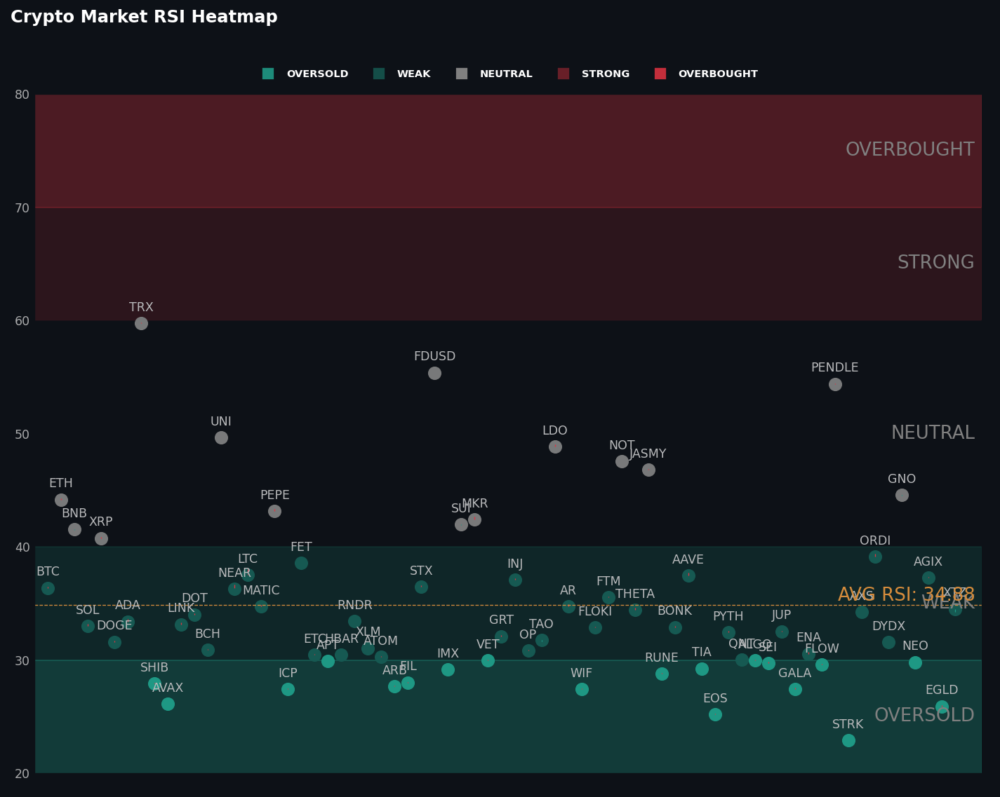
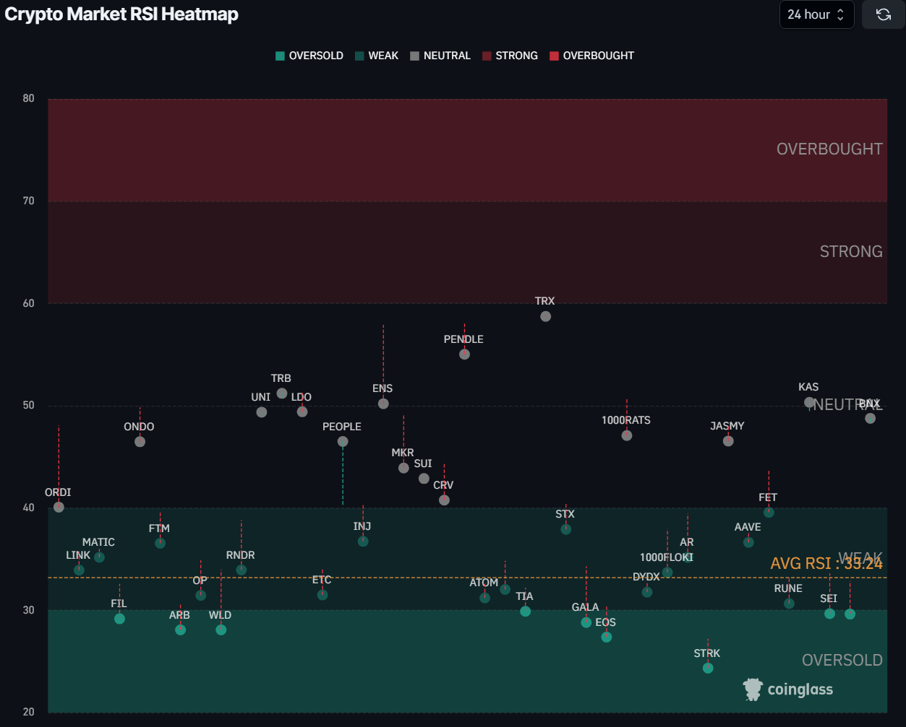

# Crypto Market RSI Heatmap 📊

This is a simple Python script that generates a RSI heatmap for the top 100 cryptocurrencies by volume using the style of [Coinglass](https://www.coinglass.com/pro/i/RsiHeatMap). The heatmap can be used to identify overbought and oversold conditions in the market.

<p align="center">
  
  
  <a href="https://github.com/psf/black"></a>
</p>

---

## Introduction

I have previously recreated this chart for my [fintwit-bot](https://github.com/StephanAkkerman/fintwit-bot), unfortunately coinglass removed their API so I had to recreate it using other sources. I used the chart found on [Coinglass](https://www.coinglass.com/pro/i/RsiHeatMap) as a reference. The data is fetched using [Coingecko's API](https://www.coingecko.com/en/api) to get the top volume coins and combined with [TradingView's API](https://github.com/AnalyzerREST/python-tradingview-ta) to get the RSI values.

## Installation ⚙️

The required packages to run this code can be found in the requirements.txt file. To run this file, execute the following code block after cloning the repository:

```bash
pip install -r requirements.txt
```

## Usage ⌨️

To generate the chart, simply run the script using the following command:

```bash
python src/main.py
```

## Example 📊

The following chart is an example of the output generated by the script.


### References 📚

The following image was used as a reference to create the RSI heatmap.


## Other Projects 📦

This project is part of a series of projects that I have created. You can find the other projects in the following list:

- [Total Liquidation Chart](https://github.com/StephanAkkerman/liquidations-chart)
- [Bitcoin Rainbow Chart](https://github.com/StephanAkkerman/bitcoin-rainbow-chart)
- [Live Binance Charts](https://github.com/StephanAkkerman/live-binance-charts)
